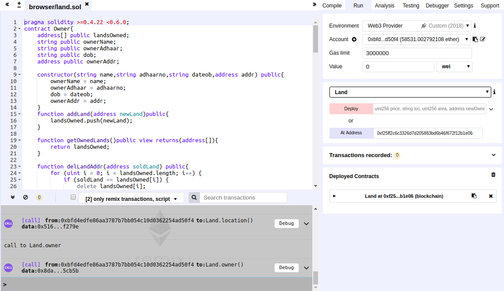
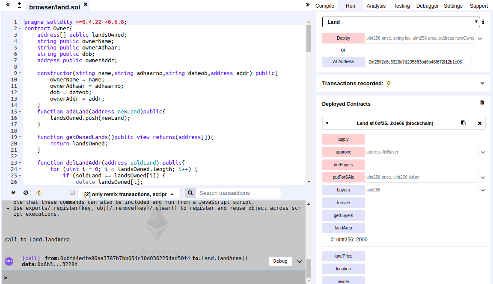
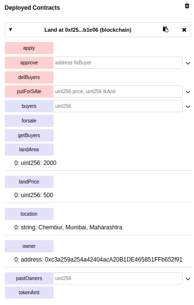
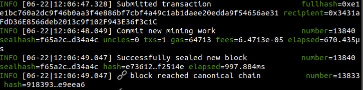
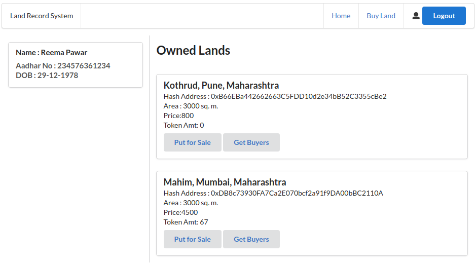
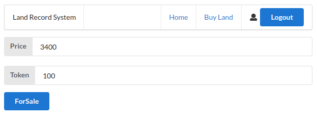
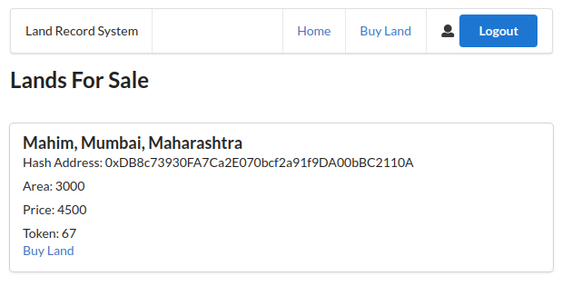
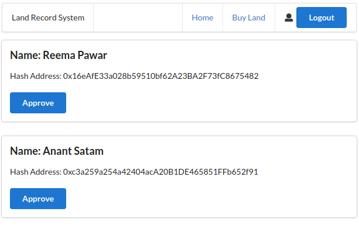

# Land-Records-Blockchain

An ethereum based private network and web app for buying and selling of lands.

## Installation steps

1. Open terminal and set the path to land-records folder
```
geth --datadir ./node1 --networkid 2018 --port 30306 --nodiscover --rpc --rpcapi "db,personal,eth,net,web3,debug" --rpccorsdomain="*" --rpcaddr="localhost" --rpcport 8545 --ws --wsapi "db,personal,eth,net,web3,debug" --wsorigins="*"  --wsaddr="localhost" --wsport 8546 console
```
2. Start the miner
```
miner.start(1)
```
3. Open new terminal and run the following command after setting the path to land-records-app
```
npm run dev
```
4. The app runs on the following link
```
localhost:3000/login
```


## Screenshots
1. Soldity remix- Set environment to the web3 provider



2. Solidity remix - Contract and its transactions



3. Land contract and its functions



4. Terminal - mining a transaction



5. Home page



6. Put land for sale



7. Buy land



8. Get buyers


